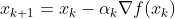

# PACS-challenges
This repo contain the code used as solution of challenges given by the course PACS (Advanced Programming for Scientific Computing)

## How to use

I developed and test my code in the docker container provided by the course. To use the code, you need to have the docker installed in your machine. Then, you can pull the image using this command:
```bash 
docker pull albertoartoni1995/mk
```

Then, you can run the container using the following command:
```bash 
docker run --name pacs-env -v /path/to/host/folder:/home/jammy/shared-folder -it -d albertoartoni1995/mk
```
I have the issue that I can't compile or modify any file in the shared folder. To solve this, I run the following command to modify the permission of read/write of the folder:
```bash 
chmod -R 777 /path/to/host/folder
```
## Challenge 1

Develop the gradient descendent method. 

All the object files (.o) will be store in the obj/ directory. 
To compile all use: 
```bash
make
``` 

To configure it use the file config.hpp where you can setup all the parameters, the function and the gradient to use. There is the possibility to change the return type of the function and the gradient, do it carefully.

If you change some parameters in _config.hpp_, I recommend to use this: 
```bash
make clean; make
```

### Parameters 
Strategy parameters:

- __mode:__ Define which strategy use to update $x_k$, already implemented are: _Heavy-Ball_, _Nesterov_ and _Default_ which is 
- __strategy:__ Define which strategy use to update $\alpha_k$, already implemented are: _exponential decay_, _Inverse decay_, _Approximate Line Search (Armijo rule)_; 

Stopping criteria:

- __max_iter:__ n° of maximum iteration;
- __step_length:__ minimum distance between x_k and $x_{k+1}$;
- __residual:__ minimum norm for the gradient of $f(x)$;

Parameters needed by some mode or strategy: 

- __mu:__ parameter for the exponential decay strategy; 
- __sigma:__ parameter for the Armijo rule in the Approximate Line Search strategy; 
- __nu:__ parameter for the Heavy-ball mode; 

Initial parameters: 
- __alpha_0:__ starting $\alpha_k$;
- __x0:__ starting $x_k$;
